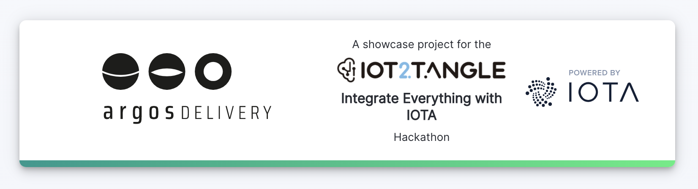

## Argos Delivery

_Argos Delivery_ is a project in the scope of the IoT2Tangle Hackathon.
The idea behind the project is to make use of IOTA Streams to track a delivery throughout the entire delivery process with the help of the immutability of the Tangle.
Sensors attached to the package send their current state to the Tangle and the Argos business logic backend determines the state of the delivery and allows to make sense of the data on the Tangle. In case of a drop, the Argos UI allows to see where and when the drop has happened.
Argos can help make deliveries safer for the receiver and better traceable for the sender. Insurance issues in case of a damage or loss can be settled easier due to more data available.

Read more about the installation and background in the [wiki](https://github.com/daniel-mader/argos-delivery/wiki).
